# 🎬 AI Short Video Creator

<div align="center">


**A full-stack web application for creating AI-powered short videos with modern React ecosystem**

[🚀 Live Demo](#) • [📖 Documentation](#documentation) • [⚡ Quick Start](#installation) • [💡 Features](#key-features)

</div>

---
## Table of Contents
- [✨ About This Project](#-about-this-project)
- [🚀 Key Features](#-key-features)
- [🛠️ Tech Stack](#-tech-stack)
- [📦 Installation & Setup](#-installation--setup)
- [🗂️ Project Architecture](#-project-architecture)
- [🛠️ Development Workflow](#-development-workflow)
- [📸 Highlight Application Screenshots](#-highlight-application-screenshots)
- [🚀 Deployment](#-deployment)
- [🛠️ Technical Challenges Solved](#-technical-challenges-solved)
- [🛠️ Code Quality & Best Practices](#-code-quality--best-practices)
- [💡 Learning Outcomes](#-learning-outcomes)
## ✨ About This Project

**AI Short Video Creator** is a personal project showcasing modern full-stack development skills. Built with Next.js 15 and the latest React 19, this application demonstrates the integration of AI services, video processing, and complex UI interactions in a production-ready web application.
- **Backend repository**: [AIShortVideoCreator-server](https://github.com/pqkkkkk/AIShortVideoCreator-server)
### 🎯 Project Highlights

- 🏗️ **Modern Architecture**: Built with Next.js 15 App Router, React 19, and TypeScript
- 🎥 **Video Processing**: Integrated Remotion for programmatic video generation
- 🤖 **AI Integration**: Connected to external AI APIs for content generation
- 🎨 **Professional UI**: Crafted with Tailwind CSS and Radix UI components
- � **Developer Experience**: ESLint, TypeScript, and modern development tools

---

## 🚀 Key Features

### 📝 **AI-Powered Script Generation**
- Integration with external AI APIs for content suggestions
- Trending content analysis and topic recommendations
- Multi-voice text-to-speech integration
- Customizable video duration and scene management

### 🎬 **Advanced Video Editor**
- Real-time video preview with Remotion
- Dynamic text overlay and emoji integration
- Background music and image customization
- Timeline-based editing interface

### 📊 **Content Management System**
- Personal video library with filtering and search
- Video status tracking (processing, completed)
- Direct upload integration to social platforms
- Performance analytics and statistics

### �️ **Technical Implementation**
- Server-side rendering with Next.js App Router
- Type-safe API integration with TypeScript
- Responsive design system with Tailwind CSS
- Component-driven architecture with Radix UI

---

## 🛠️ Tech Stack

<div align="center">

| **Frontend** | **Styling** | **Video Processing** | **Development** |
|--------------|-------------|---------------------|-----------------|
| Next.js 15.3.1 | Tailwind CSS 4.1.6 | Remotion 4.0.300 | TypeScript |
| React 19.0.0 | Radix UI | Canvas API | ESLint |
| React DOM 19.0.0 | Lucide Icons | FFmpeg Integration | PostCSS |

</div>

### Core Dependencies
```json
{
  "next": "15.3.1",
  "react": "^19.0.0",
  "remotion": "^4.0.300",
  "@remotion/player": "^4.0.300",
  "@radix-ui/react-*": "^1.x.x",
  "tailwindcss": "^4.1.6",
  "typescript": "^5.x.x"
}
```

---

## 📦 Installation & Setup

### Prerequisites
- **Node.js** >= 18.0.0
- **npm** >= 8.0.0
- **Git** for version control

### Quick Start

```bash
# Clone the repository
git clone https://github.com/pqkkkkk/AIShortVideoCreator-client-v2.git
cd AIShortVideoCreator-client-v2

# Install root dependencies
npm install

# Navigate to frontend and install dependencies
cd frontend
npm install

# Set up environment variables
cp .env.example .env.local

# Start development server
npm run dev
```

### Environment Configuration

Create `.env.local` in the `frontend/` directory:

```env
# API Configuration
NEXT_PUBLIC_API_BASE_URL=your_api_endpoint
NEXT_PUBLIC_CLOUDINARY_CLOUD_NAME=your_cloudinary_name

# Authentication (if implemented)
NEXTAUTH_SECRET=your_secret_key
NEXTAUTH_URL=http://localhost:3000

# External Integrations
NEXT_PUBLIC_YOUTUBE_API_KEY=your_youtube_key
NEXT_PUBLIC_FACEBOOK_APP_ID=your_facebook_id
```

---

## �️ Project Architecture

```
AIShortVideoCreator-client-v2/
├── 📦 package.json                 # Root package configuration
├── 📖 README.md                    # Project documentation
└── 🗂️ frontend/                    # Main Next.js application
    ├── 📱 app/                     # Next.js 15 App Router
    │   ├── 🔐 (auth)/             # Authentication routes
    │   │   ├── login/             # Login page
    │   │   └── register/          # Registration page
    │   ├── 📊 (dashboard)/        # Protected dashboard routes
    │   │   ├── my-videos/         # Video management
    │   │   ├── script/            # AI script generation
    │   │   ├── scenes/            # Scene composition
    │   │   └── statistic/         # Analytics dashboard
    │   └── 🎬 video/[videoId]/    # Dynamic video routes
    │       └── edit/              # Video editing workspace
    ├── 🧩 components/             # Reusable UI components
    │   ├── ui/                    # Base UI components (Radix)
    │   ├── video-player.tsx       # Custom video player
    │   └── app-sidebar.tsx        # Navigation sidebar
    ├── 🪝 hooks/                  # Custom React hooks
    ├── 📚 lib/                    # Utilities and type definitions
    ├── 🎥 remotion/               # Video composition logic
    ├── 🌐 services/               # API integration layer
    └── 🎨 styles/                 # Global styles and themes
```

---

## � Development Workflow

### User Journey Flow

```mermaid
graph LR
    A[🔍 Browse Trends] --> B[📝 Generate Script]
    B --> C[🎬 Design Scenes]
    C --> D[✨ Edit Video]
    D --> E[📤 Export & Share]
    
    style A fill:#e1f5fe
    style B fill:#f3e5f5
    style C fill:#e8f5e8
    style D fill:#fff3e0
    style E fill:#fce4ec
```



### Key User Flows

1. **Script Creation**: AI-powered content generation with trending topic analysis
2. **Scene Design**: Visual composition with background images and music integration
3. **Video Editing**: Real-time preview with text overlays and timing adjustments
4. **Export & Share**: Multiple format exports with social platform integration

---

## 📸 Highlight Application Screenshots

<div align="center">

### 🏠 **Dashboard**


### 📝 **Script Generation Interface**


### 🎬 **Scene Editor**


### ✨ **Video Editor**
*Professional video editing environment*

</div>

---

## 🚀 Deployment

### Vercel Deployment (Recommended)

```bash
# Install Vercel CLI
npm i -g vercel

# Deploy from frontend directory
cd frontend
vercel --prod
```

### Docker Deployment

```dockerfile
# Dockerfile example
FROM node:18-alpine
WORKDIR /app
COPY frontend/package*.json ./
RUN npm ci --only=production
COPY frontend/ .
RUN npm run build
EXPOSE 3000
CMD ["npm", "start"]
```

### Build for Production

```bash
cd frontend
npm run build
npm start
```

---

## � Technical Challenges Solved

### 1. **Video Processing Integration**
- Implemented Remotion for programmatic video generation
- Handled real-time video preview with optimal performance
- Managed complex video composition with multiple layers

### 2. **State Management**
- Custom React hooks for video context management
- Efficient state synchronization across components
- Session storage integration for workflow persistence

### 3. **UI/UX Implementation**
- Responsive design with Tailwind CSS
- Complex timeline interface for video editing
- Drag-and-drop functionality for video elements

### 4. **API Integration**
- RESTful API communication with error handling
- File upload management for media assets
- External service integration (AI APIs, social platforms)

---

## � Code Quality & Best Practices

- ✅ **TypeScript**: Full type safety across the application
- ✅ **ESLint**: Code quality and consistency enforcement
- ✅ **Component Architecture**: Reusable and maintainable components
- ✅ **Performance Optimization**: Lazy loading and code splitting
- ✅ **Responsive Design**: Mobile-first development approach
- ✅ **Error Handling**: Comprehensive error boundaries and validation

---

## � Learning Outcomes

This project demonstrates proficiency in:

- **Modern React Development**: Hooks, Context API, and latest React 19 features
- **Next.js Expertise**: App Router, SSR
- **TypeScript Mastery**: Advanced typing and type-safe development
- **Video Processing**: Integration with Remotion and canvas manipulation
- **UI/UX Design**: Component libraries and responsive design systems
- **API Integration**: RESTful services and external API consumption
- **State Management**: Complex application state handling
- **Performance**: Optimization techniques and best practices

---

**⭐ If you find this project interesting, please consider giving it a star! ⭐**

*Built with passion for modern web development and video processing technologies*

</div>